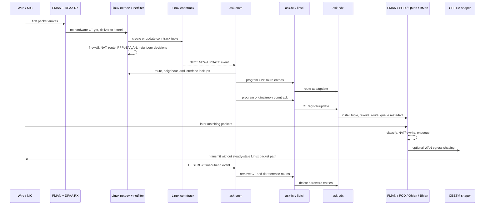

# Fast-Path Architecture

## Purpose

This file describes the active architecture of the Mono OpenWrt fork.

The key architectural choice is:

- use a boxed NXP ASK/FMAM/DPAA acceleration stack for the dataplane
- keep OpenWrt and Linux authoritative for system policy and service control

This is not a generic Linux flowtable extension. It is a separate hardware
acceleration plane integrated into OpenWrt with explicit boundaries.

## Architecture Summary

### OpenWrt / Linux Control Plane

OpenWrt and Linux remain authoritative for:

- routing
- firewall policy
- conntrack state
- PPPoE and VLAN control plane
- package and service lifecycle
- user-facing configuration

### NXP Acceleration Plane

The active hardware-acceleration plane is built from:

- `ask-cmm`
- `ask-fci`
- `libfci`
- `ask-cdx`
- `sdk_dpaa`
- `sdk_fman`
- vendor wrapper/bootstrap ownership for FMAN, PCD, and queue resources

These components own fast-path programming and resident hardware forwarding for
the supported classes.

## Life Of A Stream

A new stream starts in Linux, not in the hardware fast path. The first packets
enter through FMAN/DPAA, are delivered to the Linux netdev path, and Linux
makes the authoritative decisions: conntrack creates the tuple, firewall and
NAT apply policy, routing selects egress, PPPoE/VLAN state defines
encapsulation, and neighbour state provides the next-hop MAC.

`ask-cmm` learns from those Linux state changes. It listens to conntrack,
route, neighbour, and interface state, then builds the hardware view for
eligible flows: original tuple, reply tuple, route IDs, input/output devices,
underlying bridge/VLAN data, next-hop MAC, NAT tuple, PPPoE/VLAN rewrite
shape, and enabled directions.

The important boundary is that CMM does not become the policy engine. Linux
creates and owns the policy result; CMM translates that result into NXP
hardware objects when the flow is eligible.

### Stream Decisions

1. Linux accepts or rejects the traffic through normal OpenWrt ownership:
   firewall, NAT, routing, PPPoE, VLAN, neighbour resolution, and conntrack.

2. CMM decides whether the Linux-created stream is eligible for hardware
   residency. Local traffic, unsupported interfaces, incomplete routes or
   neighbours, unsupported features, missing direction state, and flows outside
   the validated wired-routed scope remain fallback.

3. CMM programs route entries before the conntrack entry. Route programming
   gives the hardware a route ID, output device, input device, underlying input
   device where needed, destination MAC, MTU, and VLAN metadata.

4. CMM programs the stream as original and reply directions. Each direction can
   be independently installed or disabled, and the runtime state must be
   judged with route state and tuple-level hardware counters, not installed
   state alone.

5. CDX turns the FCI commands into resident hardware dataplane state. It stores
   the CT pair, binds route IDs, marks disabled halves, and resolves route
   metadata used by FMAN, DPAA, QMan, and BMan.

6. Steady-state packets match hardware state directly. They are classified,
   NATed or rewritten, queued, optionally shaped by CEETM on WAN egress, and
   transmitted without the Linux packet path explaining the byte count.

7. When Linux conntrack destroys or expires the stream, CMM removes the
   hardware CT entry, decrements route and neighbour references, and removes
   FPP route entries whose reference count reaches zero.

## Boxed Design

“Boxed” in this fork means:

- no mixed mainline/vendor ownership on the active dataplane nodes
- vendor acceleration logic stays inside a dedicated dataplane/control stack
- OpenWrt integration is kept narrow and explicit
- vendor-specific controls are not presented as generic Linux networking APIs

This keeps the port understandable and reduces the maintenance cost compared
with carrying a broad vendor firmware diff inside the OpenWrt tree.

## Source Ownership Model

The fork uses three layers of ownership:

### 1. OpenWrt integration layer

[cvandesande/openwrt](https://github.com/cvandesande/openwrt) owns:

- target integration
- kernel patches
- DTS and config
- package recipes
- init scripts and config files
- local OpenWrt-specific patch queues where needed

### 2. Dedicated package source repos

Large vendor source trees are now fetched through normal OpenWrt package
recipes from pinned source revisions.

Current examples:

- [cvandesande/ask-cmm](https://github.com/cvandesande/ask-cmm)
- [cvandesande/ask-cdx](https://github.com/cvandesande/ask-cdx)
- shared [cvandesande/fci](https://github.com/cvandesande/fci) source for
  `ask-fci` and `libfci`

### 3. Vendor reference tree

[we-are-mono/OpenWRT-ASK](https://github.com/we-are-mono/OpenWRT-ASK)
remains the vendor reference tree for comparison, future ports, and
documentation, but it is not the active build tree.

## Normal OpenWrt Build Workflow

The dedicated package repos are integrated through normal OpenWrt packaging:

- package recipes fetch pinned source revisions
- OpenWrt unpacks them into `build_dir/`
- local integration files remain in `openwrt/package/...`
- package outputs are produced through normal OpenWrt package targets

That means the fork keeps reproducible builds without relying on ad-hoc source
copies, submodules, or developer-local working trees.

## User-Facing Boundary

The future user-facing control boundary should be:

- a dedicated NXP LuCI/UCI page for hardware controls
- separate from upstream OpenWrt SQM/CAKE controls
- separate from upstream firewall flow-offload toggles

The UI model should report:

- requested state
- actual state
- blocked or incompatible reason

It should not silently flip upstream software controls or hide software
fallback behind a generic “hardware offload” switch.

## Hardware QoS Boundary

CEETM/QM work must stay inside the same boxed design.

That means:

- treat CEETM/QM as an NXP hardware-control feature, not as a generic Linux
  qdisc or firewall extension
- keep OpenWrt and Linux authoritative for routing, firewall, conntrack, and
  software queueing policy
- do not reuse upstream SQM/CAKE controls as the primary hardware-QoS UI
- do not claim CAKE/FQ-CoDel-equivalent behavior without separate proof
- do not silently fall back to software and still present the result as
  hardware QoS

The validated CEETM scope is narrow:

- upload-side WAN egress shaping only
- on the currently validated WAN path
- with explicit proof that the CEETM-capable TX owner path is active

Download-side latency control, WiFi QoS interaction, and product-level
user-facing controls remain later work.

## Future Architecture Work

Future architecture work still includes:

- the Stage 4 NXP hardware-control boundary
- extending the validated scope beyond the current 1G proof paths
- production-ready hardware QoS controls and repeated validation
- WiFi offload
- IPsec offload
- validated IPv6 offload
- hardware QoS as a finished user-facing feature

## Why This Architecture Is Maintainable

This design is easier to maintain than a broad vendor firmware import because:

- the kernel integration layer is narrow and explicit
- vendor package sources are separated from the integration repo
- package recipes use pinned revisions
- OpenWrt-specific integration remains local and reviewable
- user-facing software ownership stays with OpenWrt instead of being absorbed
  into the vendor stack

For the current validation scope and stage status, see
[01-platform-and-lab-state.md](01-platform-and-lab-state.md). For the detailed
proof model and stage breakdown, see
[03-fman-backend-design.md](03-fman-backend-design.md).
