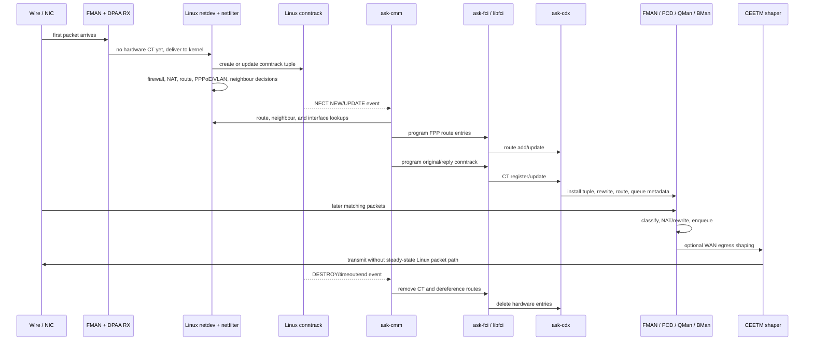

# Fast-Path Architecture

## Purpose

This file describes the active architecture of the Mono OpenWrt fork.

The key architectural choice is:

- use a dedicated NXP ASK/FMAM/DPAA acceleration stack for the dataplane
- keep OpenWrt and Linux authoritative for system policy and service control

This is not a generic Linux flowtable feature. It is a separate hardware
acceleration path with clear handoff points.

## Architecture Summary

### OpenWrt / Linux Control Plane

OpenWrt and Linux remain authoritative for:

- routing
- firewall policy
- conntrack state
- PPPoE and VLAN control plane
- package and service lifecycle
- user-facing configuration

### NXP Acceleration Plane

The active hardware-acceleration plane is built from:

- `ask-cmm`
- `ask-fci`
- `libfci`
- `ask-cdx`
- `sdk_dpaa`
- `sdk_fman`
- vendor wrapper/bootstrap ownership for FMAN, PCD, and queue resources

These components program hardware fast-path entries for flows that are allowed
to offload.

## Life Of A Stream

A new stream starts in Linux, not in hardware. The first packets enter through
FMAN/DPAA and are delivered to the normal Linux netdev path. Linux then makes
the policy decisions: conntrack creates the tuple, firewall and NAT apply,
routing selects egress, PPPoE/VLAN state defines encapsulation, and neighbour
state provides the next-hop MAC.

`ask-cmm` watches those Linux state changes. For eligible flows, it builds the
hardware view: tuples, route IDs, input/output devices, underlying bridge/VLAN
data, next-hop MAC, NAT tuple, PPPoE/VLAN rewrite data, and enabled directions.

The important boundary is that CMM does not become the policy engine. Linux
owns the decision. CMM only translates accepted Linux state into NXP hardware
objects when the flow is eligible.

### Stream Decisions

1. Linux accepts or rejects the traffic through normal OpenWrt ownership:
   firewall, NAT, routing, PPPoE, VLAN, neighbour resolution, and conntrack.

2. CMM decides whether the Linux-created stream is eligible for hardware
   residency. Local traffic, unsupported interfaces, incomplete routes or
   neighbours, unsupported features, missing direction state, and flows outside
   the validated wired-routed scope remain fallback.

3. CMM programs route entries before the conntrack entry. Route programming
   gives the hardware a route ID, output device, input device, underlying input
   device where needed, destination MAC, MTU, and VLAN metadata.

4. CMM programs the stream as original and reply directions. Each direction can
   be independently installed or disabled, and the runtime state must be
   judged with route state and tuple-level hardware counters, not installed
   state alone.

5. CDX turns the FCI commands into resident hardware dataplane state. It stores
   the CT pair, binds route IDs, marks disabled halves, and resolves route
   metadata used by FMAN, DPAA, QMan, and BMan.

6. Steady-state packets match hardware state directly. They are classified,
   NATed or rewritten, queued, optionally shaped by CEETM on WAN egress, and
   transmitted without the Linux packet path explaining the byte count.

7. When Linux conntrack destroys or expires the stream, CMM removes the
   hardware CT entry, decrements route and neighbour references, and removes
   FPP route entries whose reference count reaches zero.

## Kernel Touch Points

The vendor and ASK components touch Linux in specific places:

- the active FMAN/DPAA Ethernet dataplane uses the SDK driver path
- CMM reads Linux routing, neighbour, interface, conntrack, and XFRM state
- FCI provides the command channel from userspace to CDX/FPP
- CDX programs hardware forwarding, queueing, and SEC state
- small kernel metadata hooks expose the Linux state CMM needs for hardware
  programming

The table below lists the touch points. It does not rate them; reviewers should
judge each one from the files and behavior involved.

| Area | Linux / OpenWrt does | ASK / vendor code does | Kernel / Linux touch point |
| --- | --- | --- | --- |
| Board and DTS | Owns the device profile, ports, image layout, and sysupgrade behavior. | Adds the SDK-specific FMAN, QMan, BMan, DPA, and offline-port nodes needed by the hardware path. | `mono-gateway-dk-sdk.dts`, Layerscape target profile, image recipe. |
| Kernel driver selection | Builds the target kernel and selects the active Ethernet stack. | `sdk_fman`, `sdk_dpaa`, and `fsl_qbman` provide the active FMAN/DPAA dataplane. | Layerscape kernel config plus SDK driver Kconfig/Makefile hooks. |
| FMAN/DPAA packet path | Handles first packets and fallback traffic through the normal netdev path. | Installs and uses hardware forwarding state for eligible steady-state packets. | SDK DPAA netdev driver, FMAN/PCD, QMan, and BMan code. |
| `ask-dpa-app`, FMC, and FMLIB | Packages and starts the bootstrap tools through OpenWrt. | Programs FMAN/PCD and queue resources from the packaged hardware config. | OpenWrt packages plus FMAN userspace libraries and XML config. |
| `ask-cmm` | Keeps conntrack, route, neighbour, link, VLAN, PPPoE, and XFRM state authoritative in Linux. | Watches Linux state and sends hardware programming commands for eligible flows. | libnetfilter-conntrack, rtnetlink, and FCI sockets. |
| `ask-fci` and `libfci` | Provides kernel module and package lifecycle. | Provides the netlink command path between CMM and CDX/FPP. | `NETLINK_FF` kernel socket and `NETLINK_KEY` userspace client support. |
| `ask-cdx` | Loads as a normal kernel package. | Converts FCI commands into FPP/FMAM/DPAA/QMan/BMan/SEC hardware state. | CDX kernel module, exported CDX command symbols, proc/debug counters. |
| Conntrack metadata | Owns conntrack lifetime, tuple state, firewall/NAT result, and fallback. | Adds ASK metadata used by CMM, including interface, mark, VLAN, and XFRM-handle fields. | `nf_conn`, ctnetlink attributes, and libnetfilter-conntrack mirror fields. |
| Underlying ingress interface | Owns bridge, PPP, VLAN, and receive path behavior. | Preserves the original physical ingress interface so CMM can program correct hardware routes. | `sk_buff` metadata copied through bridge, PPP, and receive paths. |
| IPsec SEC offload | Owns XFRM policy, SA lifetime, StrongSwan integration, route/firewall decisions, and software fallback. | Passes SA handles and selected packets to DPAA/SEC for hardware crypto. | XFRM state metadata, ESP input/output hooks, `NETLINK_KEY`, and DPAA SEC submit path. |
| CEETM/QM shaping | Owns normal routing, firewall, conntrack, and software queueing policy. | Programs NXP CEETM/QM egress shaping and hardware queue counters. | SDK DPAA CEETM hooks, CDX QM commands, and CEETM/QMan counters. |
| Runtime services and proof | Starts services, loads modules, applies sysctls, and exposes standard counters. | Adds `cdx`, `fci`, and `cmm` services plus hardware counters and CMM/FPP state. | Init scripts, sysctls, `/proc`, debugfs, sysfs, `cmm`, and hardware counters. |

## Source Ownership Model

The fork uses three layers of ownership:

### 1. OpenWrt integration layer

[cvandesande/openwrt](https://github.com/cvandesande/openwrt) owns:

- target integration
- kernel patches
- DTS and config
- package recipes
- init scripts and config files
- local OpenWrt-specific patch queues where needed

### 2. Dedicated package source repos

Large vendor source trees are now fetched through normal OpenWrt package
recipes from pinned source revisions.

Current examples:

- [cvandesande/ask-cmm](https://github.com/cvandesande/ask-cmm)
- [cvandesande/ask-cdx](https://github.com/cvandesande/ask-cdx)
- shared [cvandesande/fci](https://github.com/cvandesande/fci) source for
  `ask-fci` and `libfci`

### 3. Vendor reference tree

[we-are-mono/OpenWRT-ASK](https://github.com/we-are-mono/OpenWRT-ASK)
remains the vendor reference tree for comparison, future ports, and
documentation, but it is not the active build tree.

## Normal OpenWrt Build Workflow

The dedicated package repos are integrated through normal OpenWrt packaging:

- package recipes fetch pinned source revisions
- OpenWrt unpacks them into `build_dir/`
- local integration files remain in `openwrt/package/...`
- package outputs are produced through normal OpenWrt package targets

That means the fork keeps reproducible builds without relying on ad-hoc source
copies, submodules, or developer-local working trees.

## User-Facing Boundary

The future user-facing control boundary should be:

- a dedicated NXP LuCI/UCI page for hardware controls
- separate from upstream OpenWrt SQM/CAKE controls
- separate from upstream firewall flow-offload toggles

The UI model should report:

- requested state
- actual state
- blocked or incompatible reason

It should not silently flip upstream software controls or hide software
fallback behind a generic “hardware offload” switch.

## Hardware QoS Boundary

CEETM/QM work must stay inside the same boundary model.

That means:

- treat CEETM/QM as an NXP hardware-control feature, not as a generic Linux
  qdisc or firewall extension
- keep OpenWrt and Linux authoritative for routing, firewall, conntrack, and
  software queueing policy
- do not reuse upstream SQM/CAKE controls as the primary hardware-QoS UI
- do not claim CAKE/FQ-CoDel-equivalent behavior without separate proof
- do not silently fall back to software and still present the result as
  hardware QoS

The validated CEETM scope is limited:

- upload-side WAN egress shaping only
- on the currently validated WAN path
- with explicit proof that the CEETM-capable TX owner path is active

Download-side latency control, WiFi QoS interaction, and product-level
user-facing controls remain later work.

## `CONFIG_CPE_FAST_PATH` And Future Fast-Path Slices

The vendor reference tree uses `CONFIG_CPE_FAST_PATH` as a broad umbrella, not
as a single-feature switch.

In the reference design it gates or ties together several areas:

- DPAA TX interception through `cpe_fp_tx()`
- the original dependency path for IPv4 and IPv6 IPsec offload Kconfig symbols
- the `comcerto_fp_netfilter` object and broader FPP/conntrack integration
- `qosmark` and `qosconnmark` metadata used for per-flow CEETM queue steering
- PPP/PPPoE fast-path idle accounting and link-state visibility
- bridge, tunnel, and underlying-interface metadata preservation

For this fork, do not enable `CONFIG_CPE_FAST_PATH` as a config-only fix for a
single-feature failure. That would pull ordinary packet handling toward the
full vendor CPE model and can change routing, firewall, conntrack, PPPoE,
bridge, and QoS behavior at the same time.

Targeted future slices remain feasible if they are implemented and validated as
separate milestones:

- CEETM integration: medium-high confidence because the current upload-side
  CEETM throttling path is already validated. Future per-flow queue steering
  should be ported deliberately rather than by enabling the whole CPE switch.
- PPPoE accelerated accounting: medium-high confidence, likely requiring a
  small equivalent of the vendor PPP idle/accounting glue once accelerated
  packets bypass normal Linux PPP counters.
- QoS connmark and per-flow queue steering: medium confidence. This crosses
  kernel ABI, libnetfilter-conntrack, userspace rule tooling, CMM, and DPAA
  queue selection, so it should be a dedicated ABI milestone.
- Full CPE/FPP netfilter fast path: medium feasibility but high regression
  risk. Treat it as a separate architecture milestone, not as part of IPsec or
  CEETM cleanup.
- Broad bridge, NAT, tunnel, and vendor behavior imports: low confidence as
  targeted ports. These should not be pulled in without a specific validated
  need.

### Current IPsec SEC Offload

IPsec offload is proven for the current IPv4 tunnel-mode lab scope.

In this mode, hardware SEC performs IPsec crypto for selected XFRM traffic.
OpenWrt/Linux still owns route, firewall, conntrack policy, XFRM selection, SA
lifetime, and fallback. CMM/CDX program hardware SAs, XFRM marks selected
packets with SA handles, and DPAA submits those packets to SEC.

The proof must come from SA state, packet direction, hardware IPsec/SEC
counters, remote-side ESP or inner-packet evidence, and CPU-path evidence. A
build, installed package, programmed SA, or `fp-state: installed` line is not
enough.

The first IPv4 tunnel-mode milestone is now past "SA exists" evidence and is a
validated SEC-offload baseline for the current lab tunnel. Runtime checks have
shown CMM programming SAs, CMM connection entries carrying inbound and outbound
SA handles, DPAA/SEC IPsec counters moving under real ICMP, SSH, and bulk TCP
traffic, remote-side StrongSwan counters advancing consistently, bulk TCP
reaching the available uplink range in the current lab, and Linux XFRM software
state counters staying at zero.

That proves hardware-assisted IPsec crypto for the current scope.

The package release numbers for the active CMM/CDX pins live in
`package/network/ask-cmm/Makefile` and `package/kernel/ask-cdx/Makefile`.
Two runtime fixes were especially important for TCP over the SEC-offload path:

- CMM route-MTU fallback: route entries that lacked an explicit rtnetlink MTU
  now fall back to the output interface MTU instead of programming `65535`,
  allowing CDX/FPP to compute usable IPsec SA MTUs.
- DPAA TX buffer ownership: skb-less IPsec compat frames that use pool-backed
  buffers must not be manually released from the normal TX confirmation cleanup
  path after successful transmit. FMan owns successful deallocation in that
  case; error and ERN paths still release explicitly before the common cleanup
  helper. The previous double-release pattern correlated with ESP sequence
  holes, very low bulk-TCP throughput, and hard resets without useful logs.
  Removing the second release produced sustained hardware-counter progress,
  contiguous remote ESP samples, clean SEC failure stats, and no BMan/QMan
  depletion during the current soak checks.

The current path is:

1. Outbound LAN-to-WAN tunnel packets rely on Linux/XFRM to select the offloaded
   state and mark the skb with an SA handle. The DPAA TX path can then submit
   the marked skb directly to SEC without `CONFIG_CPE_FAST_PATH`.
2. Inbound WAN-to-LAN ESP packets are submitted from the XFRM input side to
   SEC. CDX can deliver decrypted packets through the compat TX path toward the
   LAN, and the current integration punts the first inbound TCP/UDP packet for
   each inner flow back to Linux so conntrack/CMM can learn the flow.
3. CMM can program secure conntrack commands with SA handles in both
   directions, and CDX has secure-conntrack handling that binds those handles to
   SEC frame queues.

The latest bulk-TCP tests no longer show the severe throughput or softirq
symptoms seen in earlier broken images, and throughput is near the current lab
uplink. That is part of the current IPsec offload proof.

Do not reintroduce packet-rate kernel diagnostics into this baseline. The
current proof should rely on CMM/FPP state, hardware counters, remote-side
evidence, and targeted failure logs rather than success-path printk output.

### Vendor CPE/FPP IPsec Audit

The vendor reference has broader CPE/FPP hooks around IPsec, PPPoE accounting,
QoS/CEETM, bridge metadata, and flow aging. This fork should not describe those
hooks as a missing user feature until a specific behavior is identified and
validated.

If future work needs more than the proven SEC-offload path, audit the vendor
CMM/CDX/FPP code and name the exact behavior before porting it. Useful questions
include:

- Does the current path miss a specific per-flow FPP counter or accounting
  signal for inner tunnel flows?
- Does any current topology need additional PPPoE, VLAN, bridge, or QoS state
  attached to IPsec traffic?
- Does enabling a broader CPE/FPP hook change routing, firewall, conntrack, or
  XFRM ownership?
- Can the behavior be implemented through explicit Linux-owned metadata and
  CMM/CDX programming rather than by enabling the whole CPE switch?

Recommended milestones:

1. Keep the current IPv4 SEC-offload path as the baseline. It proves SA
   programming and SEC enqueue/dequeue without importing the broad vendor CPE
   model.
2. Audit the vendor CMM/CDX/FPP IPsec path and identify exactly what is gated by
   `IPSEC_NO_FLOW_CACHE` and `CONFIG_CPE_FAST_PATH`.
3. Add only the kernel/userspace ABI needed for a named missing behavior.
4. Validate the new behavior separately from the already-proven IPsec SEC crypto
   offload.

Current audit notes for the next slice:

- The vendor reference also builds CMM with `IPSEC_NO_FLOW_CACHE`. The
  immediate difference between this fork and the reference is therefore not
  "CMM flow cache on versus off." The no-flow-cache path can still accept
  conntrack XFRM handles and send IPsec SA handles in `fpp_ct_ex_cmd_t` /
  `fpp_ct6_ex_cmd_t`.
- CDX already has secure conntrack plumbing: secure CT commands set
  `CONNTRACK_SEC`, store SA handles, reject missing SAs with
  `CONNTRACK_SEC_noSA`, and use `cdx_ipsec_fill_sec_info()` to select outbound
  SEC frame queues or inbound offline-port table handling.
- `CONFIG_CPE_FAST_PATH` in the reference remains broad. It includes the Linux
  `cpe_fp_tx()` TX owner path, QoS queue selection from `qosconnmark`, PPP/PPPoE
  accounting hooks, bridge/FDB notifications, skb metadata preservation, and
  netfilter/FPP integration. It should not be enabled merely because bulk IPsec
  performance looks incomplete.
- The current direct conntrack/SA-handle path remains the preferred baseline.
  It is smaller than enabling the broad CPE switch and keeps Linux
  conntrack/XFRM as the source of truth.
- Any additional FPP validation should use an inner TCP or UDP stream across the
  tunnel. Ping is useful for SEC-path and latency smoke testing, but it is not a
  strong proof of per-flow forwarding behavior.

Validation for this future milestone must include:

- A named behavior that is not already covered by the current SEC-offload proof.
- CMM/FPP flow entries for the inner tunnel flow, if the named behavior depends
  on FPP per-flow state.
- Hardware IPsec/SEC counters moving for both directions.
- Tuple or flow counters moving in the expected direction, preferably from
  `show stat flow query` or an equivalent per-flow FPP counter.
- Remote-side ESP and inner-packet evidence.
- CPU and softirq evidence compared against software IPsec and the current
  SEC-offload path.
- Rekey, SA delete, route change, neighbour change, and tunnel teardown
  behavior.
- Topology coverage for PPPoE with VLAN, PPPoE without VLAN, VLAN without
  PPPoE, and neither PPPoE nor VLAN.
- Separate IPv4 and IPv6 results.

Stop or re-scope if the additional behavior requires a broad import of vendor
bridge, route, NAT, tunnel, WiFi, sysupgrade, bootloader, DTS, or storage
behavior. That would repeat the maintenance problem this fork is designed to
avoid.

## Future Architecture Work

Future architecture work still includes:

- the Stage 4 NXP hardware-control boundary
- extending the validated scope beyond the current 1G proof paths
- production-ready hardware QoS controls and repeated validation
- selectively porting future fast-path slices without silently enabling the
  full vendor CPE fast path
- WiFi offload
- clearly identified vendor CPE/FPP IPsec behavior, if any is needed beyond the
  current SEC-offload mode
- validated IPv6 offload
- hardware QoS as a finished user-facing feature

## Why This Architecture Is Maintainable

This design is easier to maintain than a broad vendor firmware import because:

- the kernel integration layer is explicit and reviewable
- vendor package sources are separated from the integration repo
- package recipes use pinned revisions
- OpenWrt-specific integration remains local and reviewable
- user-facing software ownership stays with OpenWrt instead of being absorbed
  into the vendor stack

For the current validation scope and stage status, see
[01-platform-and-lab-state.md](01-platform-and-lab-state.md). For the detailed
proof model and stage breakdown, see
[03-fman-backend-design.md](03-fman-backend-design.md).
