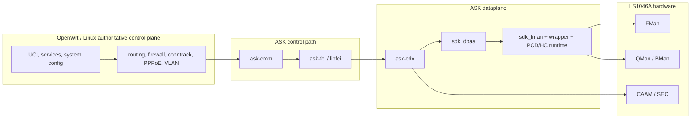

# FMAN True-Offload Design

## Purpose

This file describes the current porting design for the Mono OpenWrt fork:

- what the project is trying to achieve
- how the boxed NXP ASK/FMAM/DPAA architecture is integrated
- what stages are complete
- what still remains before the work is considered finished

## Project Goals

The goals of this fork are:

- true hardware offload for supported routed WAN classes
- honest proof that steady-state packets stop traversing the CPU datapath
- preservation of OpenWrt and Linux ownership for policy, routing, firewall,
  and service control
- a maintainable and rebase-friendly integration model

The ownership model and repo split are described in
[02-fast-path-architecture.md](02-fast-path-architecture.md). This document
focuses on the delivered engineering stages, the proof model, and the
remaining work.

## Runtime Architecture



## Delivered Stages

### Stage 1: Vendor Kernel Dataplane Port

Delivered.

What Stage 1 established:

- vendor `sdk_fman` active for the target
- vendor `sdk_dpaa` active for the target
- wrapper/bootstrap ownership for FMAN and PCD
- HC/QMan/BMan ownership active
- no mixed mainline/vendor ownership on active dataplane nodes
- stable 1G bring-up on the validated topology

Current limitation:

- 10G ports `eth3` and `eth4` are not yet physically validated

### Stage 2: ASK Runtime-State And Control-Path Foundation

Delivered.

What Stage 2 established:

- ASK kernel metadata and runtime-state foundation
- working `ask-cmm`, `ask-fci`, `libfci`, and `ask-cdx` control-path
  integration for the accepted wired-routed scope
- runtime-state visibility on target
- useful distinction between installed and fallback states

The accepted Stage 2 scope is broader than a single first proof path, but it
is still limited to the wired-routed 1G deployment shape on Mono Gateway.

### Stage 3: First True Hardware-Offload Proof

Delivered.

Validated proof path:

```text
eth2 -> eth0.10 -> pppoe-wan
IPv4 SNAT + Ethernet rewrite + VLAN 10 push + PPPoE push
```

What Stage 3 proved:

- the preferred exact class is truly hardware-resident
- original-tuple hardware stats correlate to the preferred flow
- Linux conntrack and netdev accounting remain comparatively small during the
  proof window
- the preferred route pair is present and queryable

Residual note:

- longer soak is still needed around exact flow-stat persistence and
  repeatability

### Stage 4: User-Facing OpenWrt Integration

Deferred by design.

When implemented, Stage 4 should add the dedicated NXP hardware-control
boundary described in [02-fast-path-architecture.md](02-fast-path-architecture.md),
with UCI/service integration first and later LuCI integration on a separate
NXP page.

### Stage 5: Reply-Half And Production Path

Delivered.

Validated proof path:

```text
eth1.18 -> eth0.10 -> pppoe-wan
```

What Stage 5 proved:

- direct-routed production-path offload
- explicit reply-half ownership
- tuple-level hardware correlation on the production path
- honest fallback still visible for flows that are not hardware-resident

### Stage 6: Soak, Rebase, And Cleanup

This is the next active milestone.

Stage 6 should focus on:

- longer soak and repeatability
- reboot, reconnect, and reload behavior
- cleanup of integration details
- rebase hygiene
- operator documentation and validation polish

## Observability Model

True offload means Linux packet accounting is no longer enough to explain the
steady-state datapath. The fork therefore depends on a hardware-side
observability model.

### Required Surfaces

The current design expects:

- FMAN global sysfs counters and dumps
- FMAN port sysfs counters and dumps
- SDK DPAA netdev sysfs
- QMan debugfs
- BMan debugfs
- ASK runtime-state query/readout

### Proof Model

A hardware-offload proof is not accepted from control-plane state alone.

The proof model requires correlation between:

- route state
- runtime-state/readout
- tuple-level hardware flow statistics
- FMAN counters
- Linux conntrack accounting
- CPU-path evidence

This is how the Stage 3 and Stage 5 proofs are judged honestly.

## Current Supported Scope

The currently proven scope is:

- preferred path:
  - `eth2 -> eth0.10 -> pppoe-wan`
- direct-routed production path:
  - `eth1.18 -> eth0.10 -> pppoe-wan`
- validated on the 1G topology

## Remaining Work

The following remain future work:

- Stage 6 soak and repeatability
- reboot, reconnect, and reload validation
- 10G physical proof on `eth3` and `eth4`
- Stage 4 UI and service boundary
- WiFi offload
- IPsec offload
- validated IPv6 offload
- hardware QoS as a finished product feature

Hardware shaping and CEETM/QM work may become relevant later, but they should
be treated as NXP-specific hardware controls, not as a drop-in replacement for
OpenWrt CAKE/SQM semantics.
