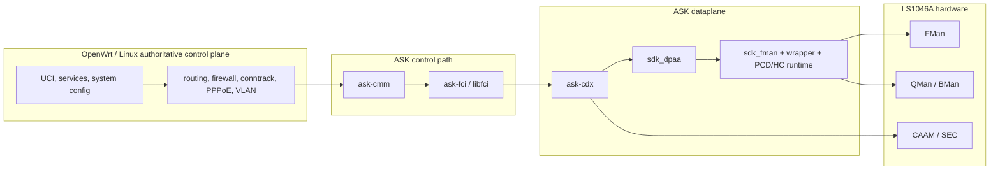

# FMAN True-Offload Design

## Purpose

This file describes the current porting design for the Mono OpenWrt fork:

- what the project is trying to achieve
- how the boxed NXP ASK/FMAM/DPAA architecture is integrated
- what stages are complete
- what still remains before the work is considered finished

## Project Goals

The goals of this fork are:

- true hardware offload for supported routed WAN classes
- honest proof that steady-state packets stop traversing the CPU datapath
- preservation of OpenWrt and Linux ownership for policy, routing, firewall,
  and service control
- a maintainable and rebase-friendly integration model

The ownership model and repo split are described in
[02-fast-path-architecture.md](02-fast-path-architecture.md). This document
focuses on the delivered engineering stages, the proof model, and the
remaining work.

## Runtime Architecture



## Delivered Stages

### Stage 1: Vendor Kernel Dataplane Port

Delivered.

What Stage 1 established:

- vendor `sdk_fman` active for the target
- vendor `sdk_dpaa` active for the target
- wrapper/bootstrap ownership for FMAN and PCD
- HC/QMan/BMan ownership active
- no mixed mainline/vendor ownership on active dataplane nodes
- stable 1G bring-up on the validated topology

Current limitation:

- 10G ports `eth3` and `eth4` are not yet physically validated

### Stage 2: ASK Runtime-State And Control-Path Foundation

Delivered.

What Stage 2 established:

- ASK kernel metadata and runtime-state foundation
- working `ask-cmm`, `ask-fci`, `libfci`, and `ask-cdx` control-path
  integration for the accepted wired-routed scope
- runtime-state visibility on target
- useful distinction between installed and fallback states

The accepted Stage 2 scope is broader than a single first proof path, but it
is still limited to the wired-routed 1G deployment shape on Mono Gateway.

### Stage 3: First True Hardware-Offload Proof

Delivered.

Validated proof path:

```text
eth2 -> eth0.10 -> pppoe-wan
IPv4 SNAT + Ethernet rewrite + VLAN 10 push + PPPoE push
```

What Stage 3 proved:

- the preferred exact class is truly hardware-resident
- original-tuple hardware stats correlate to the preferred flow
- Linux conntrack and netdev accounting remain comparatively small during the
  proof window
- the preferred route pair is present and queryable

Residual note:

- longer soak is still needed around exact flow-stat persistence and
  repeatability

### Stage 4: User-Facing OpenWrt Integration

Deferred by design.

When implemented, Stage 4 should add the dedicated NXP hardware-control
boundary described in [02-fast-path-architecture.md](02-fast-path-architecture.md),
with UCI/service integration first and later LuCI integration on a separate
NXP page.

### Stage 5: Reply-Half And Production Path

Delivered.

Validated proof path:

```text
eth1.18 -> eth0.10 -> pppoe-wan
```

What Stage 5 proved:

- direct-routed production-path offload
- explicit reply-half ownership
- tuple-level hardware correlation on the production path
- honest fallback still visible for flows that are not hardware-resident

### Stage 6: Soak, Rebase, And Cleanup

This is the next active milestone.

Stage 6 should focus on:

- longer soak and repeatability
- reboot, reconnect, and reload behavior
- cleanup of integration details
- rebase hygiene
- operator documentation and validation polish

## CEETM Upload-Shaping Proof

The first CEETM milestone is validated for upload-side WAN egress shaping on
the current 1G routed WAN path.

The implemented prerequisite is a narrow CEETM-capable TX owner path in the
DPAA Ethernet driver. It is guarded behind
`CONFIG_FSL_DPAA_ASK_CEETM_TX_OWNER` and uses the CDX CEETM FQ callback only
after CDX has created the CEETM context and explicitly enabled egress QoS for
the interface.

Validated behavior on April 26, 2026:

- `eth0` was assigned to CEETM channel 1
- `set qm interface eth0 qos on` succeeded without breaking WAN
- `query qm interface eth0` reported active CEETM egress state
- the CEETM port shaper was set to `20000` kbps and queried back
- a 64 MiB host-side upload through `pppoe-wan` measured about 18.37 Mbps
- after restoring the port shaper to `100000` kbps, the same upload measured
  about 45.5 Mbps
- CEETM class queue 0 hardware counters increased during the tests
- no `ASK CEETM TX owner` kernel errors were observed
- PPPoE, FPP route entries, and CMM connection entries remained present after
  CEETM activation

The proof is intentionally limited. It is not a download-side latency or
bufferbloat proof, not a CAKE/FQ-CoDel-equivalence claim, and not Stage 4
user-facing integration.

### Manual Egress QoS Enablement

These commands enable the validated upload-side hardware egress shaper on the
current WAN lower interface. They are manual runtime commands, not the final
Stage 4 user-facing integration.

Use the WAN lower interface, not the PPPoE interface or VLAN subinterface:

```sh
WAN_IF=eth0
```

Check the current state first:

```sh
cmm -c "query qm interface $WAN_IF"
```

If the query already starts with `Egress QOS info eth0::`, CEETM is already
enabled for `eth0`; skip the channel assignment and `qos on` commands and only
set or adjust the shaper.

Enable CEETM egress QoS and set the port shaper when the query reports
`Interface eth0 qos disabled`:

```sh
cmm -c "set qm channel 1 assign interface $WAN_IF"
cmm -c "set qm interface $WAN_IF qos on"
cmm -c "set qm interface $WAN_IF shaper on rate 95000 bucketsize 8192"
cmm -c "query qm interface $WAN_IF"
```

On older images, re-running the channel assignment after CEETM is already
enabled may print `FPP_CMD_QM_CHNL_ASSIGN` with error code `65534` and log
`channel number 0 already assigned to iface eth0`. If the subsequent
`query qm interface eth0` still shows `Egress QOS info eth0::`, that duplicate
assignment error is harmless. Newer images treat same-interface channel
assignment as idempotent while still rejecting assignment of the same channel
to a different interface.

For an ISP upload service capped at 100 Mbps, `95000` kbps is the recommended
starting value. The hardware shaper should be slightly below the ISP cap so the
router, not the upstream policer, is the upload bottleneck. If loaded upload
latency still rises too much, reduce the value in small steps, for example to
`90000` kbps. Do not treat this as download-side bufferbloat control.

The expected query output should include an egress QoS section for `eth0` and a
port shaper line similar to:

```text
Egress QOS info eth0::
port shaper:: rate in kbps 95000, bucketsize 8192
```

Stop and disable the feature if WAN connectivity drops or the kernel logs new
`ASK CEETM TX owner` errors:

```sh
cmm -c "set qm interface $WAN_IF shaper off"
cmm -c "set qm interface $WAN_IF qos off"
```

### CEETM Scope Rules

To keep the work boxed and technically honest:

- treat this as upload-side WAN egress shaping first
- do not claim download-side bufferbloat control from the initial CEETM work
- do not present CEETM as a drop-in CAKE/SQM equivalent
- do not route the feature through upstream firewall flow-offload or SQM
  semantics
- keep the control surface NXP-specific
- stop if CEETM activation requires a broader dataplane redesign than the
  current boxed architecture allows

### What Counts As Success

The first acceptable CEETM milestone is:

- `query qm <wan-lower-iface>` no longer reports egress QoS disabled
- a CEETM shaper can be set and queried back honestly
- upload throughput can be capped below line rate using the hardware path
- the proof remains bounded to upload-side shaping
- Stage 3/5 offload behavior still works

Anything weaker than that should be reported as incomplete.

## Observability Model

True offload means Linux packet accounting is no longer enough to explain the
steady-state datapath. The fork therefore depends on a hardware-side
observability model.

### Required Surfaces

The current design expects:

- FMAN global sysfs counters and dumps
- FMAN port sysfs counters and dumps
- SDK DPAA netdev sysfs
- QMan debugfs
- BMan debugfs
- ASK runtime-state query/readout

### Proof Model

A hardware-offload proof is not accepted from control-plane state alone.

The proof model requires correlation between:

- route state
- runtime-state/readout
- tuple-level hardware flow statistics
- FMAN counters
- Linux conntrack accounting
- CPU-path evidence

This is how the Stage 3 and Stage 5 proofs are judged honestly.

## Current Supported Scope

The currently proven scope is:

- preferred path:
  - `eth2 -> eth0.10 -> pppoe-wan`
- direct-routed production path:
  - `eth1.18 -> eth0.10 -> pppoe-wan`
- upload-side CEETM hardware egress shaping:
  - WAN lower interface `eth0`
  - PPPoE WAN path through `eth0.10 -> pppoe-wan`
  - default CEETM class queue 0
- validated on the 1G topology

## Remaining Work

The following remain future work:

- Stage 6 soak and repeatability
- 10G physical proof on `eth3` and `eth4`
- Stage 4 UI and service boundary
- repeat CEETM validation across reboot, reconnect, and reload cycles
- WiFi offload
- IPsec offload
- validated IPv6 offload
- hardware QoS as a finished product feature

Hardware shaping and CEETM/QM work should be treated as NXP-specific hardware
controls, not as a drop-in replacement for OpenWrt CAKE/SQM semantics.
